# Social Media Post generator

---

This project aims to build a 

---

## Tech Stack
- **Frontend**: Streamlit
- **Backend**: LangChain, langchain_core, Python
- **LLMs**: Llama 3.3 70b
- **Database**: json
- **Other Tools**: Sentence Transformers

---

## Features

- Fewshot learning style mimicry
- Generate post with exact same writing styles that of influencers
- Regeneration and tweaking
- Transformer based sentence embeddings
- Integration with langchain
- Streamlit based web interface
- Tone costumisation, length control, multilanguage

---

## Project Structure
```
├── data
│   ├── raw_posts.json
│   ├── processed_posts.json
├── llm_helper.py
├── preprocess.py
├── post_generator.py
├── similarity.py
├── few_shot.py
└── post_generator.py
```

## Flow



---

## Setup Instructions

Clone the repository and put your groq api key in the .env file preferably llama model and run streamlit run main.py in terminal.
